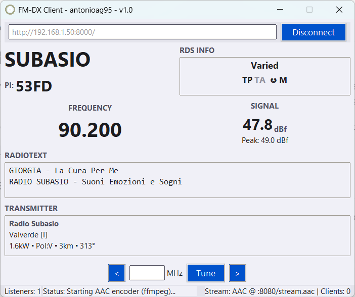
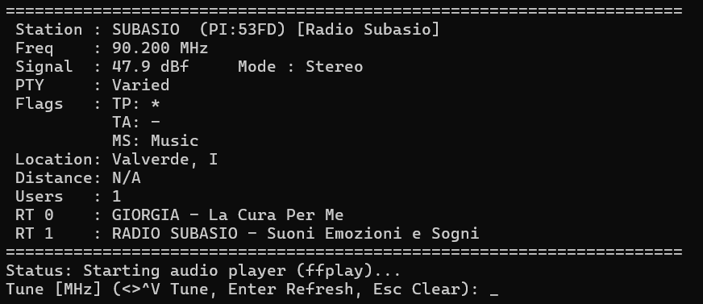

# FM-DX Client

[](https://www.gnu.org/licenses/gpl-3.0)

A Python-based client for [FM-DX Webserver](https://github.com/NoobishSVK/fm-dx-webserver) sources. It displays FM Radio Data System (RDS) metadata, optionally plays the received MP3 audio locally using `ffplay`, and can optionally re-encode and restream the audio as AAC over HTTP using `ffmpeg` and `aiohttp`.

The client offers both a graphical user interface (GUI) using Tkinter (default) and a command-line interface (CLI) using `readchar`.

<p align="center">
  
</p>

<p align="center">
  
</p>

## Features

*   **WebSocket Client:** Connects to separate text (JSON) and audio (MP3) WebSocket endpoints. Handles automatic reconnection attempts.
*   **Rich RDS Display:** Parses and displays:
    *   Program Service name (PS)
    *   Program Identification code (PI)
    *   Program Type (PTY) name
    *   RadioText (RT/RT+) messages
    *   Traffic Program (TP) and Traffic Announcement (TA) flags
    *   Music/Speech (MS) flag
    *   Stereo/Mono indicator
    *   Transmitter Information (Name, City, Country/ITU, ERP, Polarity, Distance, Azimuth)
    *   Signal Strength (Current and Peak, assumes dBf unit)
    *   Active listener count (if provided)
*   **Local Audio Playback:** Pipes the received MP3 audio stream to `ffplay` for local listening (can be disabled).
*   **AAC Restreaming:** Optionally re-encodes MP3 to AAC in real-time using `ffmpeg` and serves it via a local HTTP server (`aiohttp`), allowing other devices on the network to listen.
*   **Dual Interface:**
    *   **GUI Mode (Default):** User-friendly graphical interface using Tkinter.
    *   **CLI Mode (`--cli`):** Terminal-based interface suitable for servers or headless operation.
*   **Restream-Only Mode (`--restream-only`):** Disables local `ffplay` audio output, focusing solely on receiving data and AAC restreaming. Automatically enables the `--stream` flag.

## Requirements

### Python and Libraries

*   **Python 3.x**
*   **Core Libraries:**
    *   `websockets`: For WebSocket communication.
    *   *(Install using: `pip install websockets`)*
*   **GUI Mode Library:**
    *   `tkinter`: Usually included with standard Python installations, but might need separate installation on some systems (e.g., `sudo apt-get install python3-tk` on Debian/Ubuntu). Required only for the default GUI mode.
*   **CLI Mode Library:**
    *   `readchar`: For capturing keyboard input in the terminal. Required only for CLI mode (`--cli`).
    *   *(Install using: `pip install readchar`)*
*   **Streaming Libraries:**
    *   `aiohttp`: For the asynchronous HTTP server used for AAC streaming. Required only if using the `--stream` or `--restream-only` flags.
    *   *(Install using: `pip install aiohttp`)*

### External Programs

*   **`ffplay`:** Required for **local audio playback** (i.e., when *not* using `--restream-only`). Part of the FFmpeg suite.
*   **`ffmpeg`:** Required for **AAC restreaming** (i.e., when using `--stream` or `--restream-only`). Part of the FFmpeg suite.

You need to install FFmpeg (which includes both `ffmpeg` and `ffplay`) and ensure both commands are available in your system's PATH. Installation methods vary by OS:

- **Debian/Ubuntu:** `sudo apt update && sudo apt install ffmpeg`
- **macOS (Homebrew):** `brew install ffmpeg`
- **Windows:** Download from the [official FFmpeg website](https://ffmpeg.org/download.html) and add the `bin` directory to your system's PATH.


## Installation

1.  **Clone the repository:**
    ```bash
    git clone https://github.com/antonioag95/fm-dx-client.git
    cd fm-dx-client
    ```

2.  **Install required Python libraries:**
    *   **For both GUI/CLI + Streaming:**
        ```bash
        pip install websockets readchar aiohttp
        ```
    *   **For GUI only (no streaming/CLI):**
        ```bash
        pip install websockets
        # Ensure tkinter is available
        ```
    *   **For CLI only (no streaming):**
        ```bash
        pip install websockets readchar
        ```

3.  **Install FFmpeg:** Follow the instructions in the [Requirements](#external-programs) section for your operating system. Verify that `ffmpeg` and `ffplay` are accessible from your terminal.

## Usage

The script can be run in either GUI (default) or CLI mode.

### Server Address Format

The client needs the address of the FM-DX Webserver WebSocket source.
*   Format: `hostname:port` (e.g., `yourserver.com:8073`)
*   You can optionally prefix with `http://` or `https://`. The scheme determines the WebSocket protocol (`ws://` or `wss://`) used for the connection. If no scheme is provided, `http://` (`ws://`) is assumed.

### GUI Mode (Default)

Run the script without the `--cli` flag. You can optionally provide the server address as an argument to pre-fill the address bar.

```bash
# Launch the GUI (enter address manually)
python fm-dx-client.py

# Launch the GUI and pre-fill the address (will auto-connect)
python fm-dx-client.py yourserver.com:8073 [options]
```

**Interaction:**
*   Enter the server address in the top entry field.
*   Click **Connect**.
*   Use the **<** / **>** buttons or enter a frequency (in MHz) and click **Tune** (or press Enter in the frequency field) to change stations.
*   Keyboard shortcuts for tuning: Left/PageDown (tune down), Right/PageUp (tune up).
*   Click **Disconnect** to stop.
*   The status bar shows connection status, listener count, and streaming status (if enabled).

### CLI Mode (`--cli`)

Run the script with the `--cli` flag. The server address is **required** as an argument in this mode.

```bash
python fm-dx-client.py --cli yourserver.com:8073 [options]
```

**Interaction:**
*   The terminal will display the current station info, RDS data, signal strength, etc.
*   A prompt `Tune [MHz] (...)` appears at the bottom.
*   **Tuning:**
    *   Type a frequency (e.g., `90.2`) and press **Enter** to tune.
    *   Use **Up/Right Arrow** keys to tune up by the step (default 100 kHz).
    *   Use **Down/Left Arrow** keys to tune down.
*   **Input Control:**
    *   **Backspace:** Delete the last character in the frequency input.
    *   **Esc:** Clear the frequency input buffer.
*   **Refresh:** Press **Enter** when the input buffer is empty to refresh the display with the latest data.
*   **Exit:** Press **Ctrl+C** to quit the application.

### Command-Line Options

| Argument/Option         | Shorthand | Description                                                                                                                                                           | Default                | Required        |
| :---------------------- | :-------- | :-------------------------------------------------------------------------------------------------------------------------------------------------------------------- | :--------------------- | :-------------- |
| `server_address`        |           | Server address and port (e.g., `example.com:8073`). Scheme optional.                                                                                                | `None`                 | **Yes (for CLI)** |
| `--stream`              | `-s`      | Enable AAC (`96k`) restreaming via HTTP. Requires `ffmpeg` and `aiohttp`. Stream accessible at `http://<your-ip>:<port>/stream.aac`.                                   | Disabled               | No              |
| `--port PORT`           | `-p PORT` | Port number for the AAC restreaming HTTP server.                                                                                                                      | `8080`                 | No              |
| `--cli`                 |           | Run in Command Line Interface (CLI) mode instead of GUI. Requires `readchar`.                                                                                       | GUI Mode               | No              |
| `--restream-only`       |           | Run without local `ffplay` audio output. Focuses on data reception and restreaming. Implies `--stream`. Requires `ffmpeg` and `aiohttp`.                            | Disabled               | No              |

## AAC Restreaming (`--stream` / `--restream-only`)

When enabled, the client performs the following:
1.  Receives the MP3 audio stream from the WebSocket server.
2.  Pipes the MP3 data to an `ffmpeg` process.
3.  `ffmpeg` re-encodes the audio from MP3 to AAC (default bitrate `96k`) in ADTS format suitable for streaming.
4.  An `aiohttp` web server runs locally on the specified port (default `8080`).
5.  The server makes the real-time AAC stream available at the path `/stream.aac`.

You can listen to this AAC stream using players like VLC, foobar2000, or web browsers by opening the URL:

`http://<your-local-ip>:<port>/stream.aac`

Replace `<your-local-ip>` with the IP address of the machine running `fm-dx-client.py` on your local network, and `<port>` with the chosen streaming port (default `8080`).

## How It Works Briefly

1.  **WebSocket Connections:** Two persistent WebSocket connections are established with the server:
    *   `/text`: Receives JSON-formatted RDS and metadata updates.
    *   `/audio`: Receives raw MP3 audio data chunks.
2.  **Data Processing:** Incoming JSON is parsed to update RDS fields.
3.  **Audio Handling:**
    *   **Local Playback:** If enabled, MP3 chunks are piped directly to `ffplay`'s standard input.
    *   **Restreaming:** If enabled, MP3 chunks are piped to `ffmpeg`'s standard input. `ffmpeg` outputs AAC chunks via its standard output.
4.  **AAC Server:** If restreaming, an `aiohttp` server reads AAC chunks from `ffmpeg`'s output and sends them to connected HTTP clients requesting the `/stream.aac` path.
5.  **Interface:** Either the Tkinter GUI or the CLI handles user input (tuning commands) and displays the processed RDS data and status updates received from the backend controller. Communication between the UI thread and the backend `asyncio` controller happens via thread-safe queues.

## License

This project is licensed under the **GNU General Public License v3.0**. See the `LICENSE` file for full details.

## Author

*   Original work by **antonioag95**.

## Acknowledgements

*   This client is designed to work with the [fm-dx-webserver](https://github.com/NoobishSVK/fm-dx-webserver) project.

## Contributing / Bug Reports

Feel free to open an issue on the GitHub repository for bug reports, feature requests, or questions. Pull requests are also welcome.
